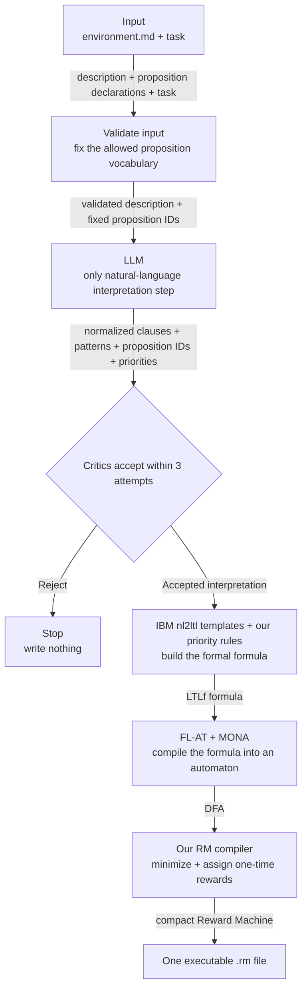
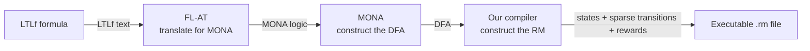

# schema-rm-rl

`schema-rm-rl` converts environment Markdown and critic-validated natural-language tasks into
formally compiled Reward Machines. The model decomposes each task into at most ten
conjunctive clauses using only `Existence`, `ExistenceTwo`, or `Precedence` and declared
propositions. The compiler owns formulas, rewards, automata, and RM topology; the model
never invents numeric rewards, LTL, or transitions.

V1 ends after Reward Machine generation. It does not train or evaluate an RL agent.

## Quick start

Install Git and Conda, then clone the repository with its pinned dependencies:

```bash
git clone --recurse-submodules \
  https://github.com/MiquelGomezCorral/TFM-schema-rm-rl.git
cd TFM-schema-rm-rl

# For an existing clone:
git submodule update --init --recursive
```

The parent repository pins exact fork commits under `dependencies/nl2ltl` and
`dependencies/Flat`. Create the Python 3.13 environment and install the complete
project:

```bash
conda create --name RM_RL_env python=3.13 -y
conda activate RM_RL_env

python -m pip install uv
uv pip install -r requirements.txt
uv pip install -e .

cp example.env .env
```

Choose a provider in `.env` and set its model. For OpenCode, set `OPENCODE_API_KEY` and
keep or change the configured model. To use an Antigravity Google subscription instead,
run `agy` interactively once to sign in, then set:

```dotenv
LLM_PROVIDER=antigravity
ANTIGRAVITY_MODEL=<slug from agy models>
```

Antigravity uses its local cached account session and subscription quota, so it needs no
API key. The application starts `agy` in non-interactive mode with no tools and consumes
the subscription quota for each request. Its own CLI may retain account/session history
independently of this application's logs. Install MONA as described below, then verify
the local installation without calling an LLM:

```bash
mona -v
python app/main.py --help
```

Jupyter support is optional:

```bash
uv pip install ipykernel
python -m ipykernel install --user --name=RM_RL_env --display-name "Python (RM_RL_env)"
```

The pinned `nl2ltl` fork removes its obsolete mandatory OpenAI pin while retaining
`pylogics`. The pinned FL-AT fork exposes the compiler API used here.

### Editing a dependency fork

Submodules are normally checked out at detached commits. Before editing one, switch to
the fork's default branch and add the original repository as `upstream`:

```bash
cd dependencies/nl2ltl
git switch main
git pull --ff-only origin main
git remote add upstream https://github.com/IBM/nl2ltl.git

cd ../Flat
git switch master
git pull --ff-only origin master
git remote add upstream https://github.com/Jamidd/Flat.git
```

In both submodules, `origin` is the maintained fork and `upstream` is the original
project. Commit and push dependency changes on `main` or `master`, then return to the
parent repository and commit the updated submodule gitlink.

## Install MONA from source

Download MONA from <https://www.brics.dk/mona/download.html>, unpack the source, and
follow its source build:

```bash
./configure --prefix="$HOME/.local"
make
make install
export PATH="$HOME/.local/bin:$PATH"
mona -v
```

The `mona` executable must be on `PATH`. Compilation fails with a clear error when it
is unavailable. System build tools and the dependencies listed by MONA may need to be
installed first.

## Environment Markdown

Normal Markdown prose is allowed, but exactly one strict proposition section is
required. Every nonblank line in it must use this shape:

```markdown
## Propositions
- `p1`: Passenger 1 entered the taxi.
- `d1`: Passenger 1 was delivered.
```

Identifiers must match `^[a-z_][a-z0-9_]*$`, be unique, and cannot be `true` or
`false`. Validation errors include the offending line. See
`examples/multitaxi/environment.md` for the transition-based MultiTaxi propositions.

## Generate a Reward Machine

Configure one supported provider in `.env`. OpenCode uses:

```bash
LLM_PROVIDER=opencode
OPENCODE_API_KEY="..."
OPENCODE_BASE_URL=https://opencode.ai/zen/v1
OPENCODE_MODEL=nemotron-3.5-lightning-free
```

Antigravity uses the cached Google subscription instead of an API key:

```bash
LLM_PROVIDER=antigravity
ANTIGRAVITY_MODEL=<slug from agy models>
```

Authenticate once with `agy` interactively before running the command. The provider is
invoked headlessly with schema-constrained JSON output and no permission-enabled tools.

Run the compiler from the repository root:

```bash
python app/main.py generate-rm \
  --environment examples/multitaxi/environment.md \
  --task "Eventually deliver passengers 1 and 2" \
  --task "Deliver passenger 1 before passenger 2" \
  --output multitaxi.rm \
  --overwrite
```

Each task may contain several ordinary-language requirements. The model normalizes
them into conjunctive clauses and infers `soft` ordering only from explicit preference
language; categorical ordering is `hard`. Unary clauses use `none`.

The command displays timed progress for every task attempt and critic stage. Both critics
run by default; use `--no-task-critic` or `--no-rm-critic` to disable one. Each task has at
most three attempts, and no output is written unless every task is accepted. The stages
are structured proposal generation, task critic, DECLARE/LTLf materialization,
FL-AT/MONA DFA compilation, Reward Machine construction, and Reward Machine critic.

Each accepted task's clauses are compiled through MONA and composed into one
task-specific Reward Machine. Separate tasks are never composed. `--output`
is a file name, not a path; files are always written under `Configuration.OUTPUT_PATH`.
Multiple tasks number the stem, so the example writes `multitaxi-1.rm` and
`multitaxi-2.rm` under that directory. All target paths are
checked before compilation, and existing files are rejected unless `--overwrite` is
supplied.

Progress logs use `[total 12.345s | step 1.234s]` prefixes. Total time is measured
from run start; step time is measured since the preceding progress entry. Every run writes
the same plain-text records to a unique `logs/run-<UTC timestamp>.log` file. The log path
is printed first, and the file is retained until you delete it manually. It includes the
validated proposal JSON, critic verdicts, each LTLf clause, complete DFA data, and the
serialized Reward Machine. Credentials, environment variables, request headers, full
prompts, and raw provider responses are not written.

The output uses the current TFM runtime's numeric semicolon format. For example, a
hard `d1`-before-`d2` machine has one success final state and a declared rejecting
sink:

```text
s: 0, 1, 2
i: 0
f: 3
r: 0
0; 1; !d1,d2; 0
0; 2; d1,!d2; 0
0; 1; d1,d2; 0
2; 3; !d1,d2; 1.10
2; 3; d1,d2; 1.10
```

Missing transitions are zero-reward self-loops. Only state-changing transitions and
necessary nonzero-reward transitions are emitted, using propositions from that
task only. The rejecting sink has no explicit outgoing rows, so it remains
there through the same implicit self-loop rule.

Each clause pays `+0.10` once on its preferred completion path. Soft reverse or
simultaneous ordering remains valid but pays `0`; hard reverse or simultaneous ordering
enters the rejecting sink. Completing all clauses adds `+1.00`. With at most ten clauses,
pre-terminal shaping stays below the final-task reward and no reward repeats in cycles.

## Local web UI

Install the declared dependencies in the Python 3.13 environment, then start the local
Dash interface from the repository root:

```bash
uv pip install -r requirements.txt
uv pip install -e .
python app/app.py
```

The UI uses the provider configured in `.env` (`LLM_PROVIDER`, its matching model, and
provider-specific credentials or base URL). Antigravity uses the cached `agy` account
session and requires no API key. The UI does not accept or display credentials. MONA must
be installed separately and available on `PATH` (or configured through
`MONA_EXECUTABLE`), just as for the CLI.

Upload a UTF-8 environment Markdown file or paste it into the editor, add one or more
tasks, and provide one base output filename. The UI
validates each task automatically with the selected critics. Multiple tasks retain the CLI's numbered output
behavior under `Configuration.OUTPUT_PATH`, for example `batch-1.rm`, `batch-2.rm`, and
`batch-3.rm`. Each completed file is shown with its exact path, serialized text, and
read-only state graph.

Run status opens on the Steps tab. It shows the current task, attempt, six stage states,
durations, and the latest retry reason. Blue means running, green completed, gray pending
or skipped, and red failed; every state also has a text label. The Log tab retains the
complete timed multiline records. With multiple tasks, previous/next buttons and up to
five task dots navigate the sequential run; the selection follows the active task only
when you were viewing the previous active task.

This is a local single-run interface: only one run may be active at a time, jobs are not
persisted, and the UI does not provide cancellation, overwrite controls, authentication,
or multi-user isolation.

## Limitations and licensing

- `Absence`, `RespondedExistence`, `Response`, `ChainResponse`, and
  `NotCoExistence` do not have executable V1 reward semantics and are rejected rather
  than assigned ambiguous rewards.
- Structured output requires a compatible provider model. An unsupported model is an
  API or CLI error and is not silently retried or downgraded.
- The upstream FL-AT repository does not declare a license. Its public adaptation fork
  is maintained at the project owner's accepted publication risk while the
  [license request](https://github.com/Jamidd/Flat/issues/1) remains unresolved.

## How the pipeline uses the formal tools



Input validation is not another interpretation step. It only checks that the Markdown
contains one valid proposition section, that proposition IDs are unique and safe for
the formal tools, and that later stages can use only that fixed vocabulary. This stops
the LLM from inventing events that the environment cannot emit.

There is only one NLP step in the current pipeline. The configured OpenCode, OpenAI, or
Antigravity model reads
the task and chooses constrained clauses, proposition IDs, and inferred priorities. IBM
`nl2ltl` is not running a second language model here: we use its deterministic DECLARE
template classes to turn the accepted choice into a `pylogics` LTLf formula. The LLM
does not generate LTLf, automaton states, transitions, numeric rewards, or output files.
Everything after critic acceptance is deterministic code and formal compilation.

The main ownership boundary is: **FL-AT and MONA compile the critic-accepted LTLf formula
into the formal DFA; `schema-rm-rl` converts that DFA into the executable Reward
Machine.** The current pipeline calls FL-AT's `compile_dfa()` entry point, not its
original `compile_reward_machine()` path.

| Tool | What this project uses | What this project does not use, and why |
|---|---|---|
| IBM `nl2ltl` | The `Existence`, `ExistenceTwo`, and `Precedence` DECLARE templates, their argument checks, and `pylogics` formula objects. `Existence` and `ExistenceTwo` use the template's `to_ltlf()` method. | Its GPT and Rasa engines, grounding, filters, confidence ranking, and generic `translate()` wrapper are unnecessary because this project has a schema-constrained provider engine and critic gates. PPLTL is unused because FL-AT receives LTLf. Other DECLARE templates are rejected until their executable reward and violation semantics are defined. |
| FL-AT | The LTLf lexer, parser, translation to MONA logic, MONA process invocation, and DFA output parser exposed through `flat_tool.compile_dfa()`. | PDDL3, PLTL, and regular-expression inputs are outside the current LTLf pipeline. FL-AT's old CLI, automata composition, reward assignment, and RM serializer are unused because this project creates one RM per task and owns its one-time reward and compact runtime semantics. |
| `schema-rm-rl` | Environment parsing, LLM request validation, priority semantics, bounded critics, LTLf serialization, DFA normalization and minimization, reward assignment, and RM serialization. | It does not invent formal automaton topology; MONA remains responsible for compiling the accepted formula. |

For precedence, the IBM template supplies the constrained pattern and argument order,
but this project builds the final formula itself. Non-hard priorities require both
events while allowing either order. Hard priority requires strict preferred ordering
and rejects reverse or simultaneous completion.

## MONA's role

MONA is a formal logic compiler and decision procedure, not an AI model. FL-AT
translates an accepted LTLf formula into MONA's logic, and MONA constructs the
deterministic finite automaton that recognizes traces satisfying that formula.



After MONA runs, the modified FL-AT adapter parses its DFA text and removes a proven
event-ignoring preamble when present. It then passes the parsed DFA to our RM compiler.

The local MONA source contains several subsystems:

| MONA component | Purpose in MONA | Use in this project |
|---|---|---|
| `Front/` | Parses and processes logical formulas. | Used indirectly through the `mona` executable. |
| `BDD/` | Represents Boolean conditions efficiently. | Used internally by MONA. |
| `DFA/` | Builds and manipulates automata over finite strings. | This is the automaton output the pipeline needs. |
| `GTA/` | Builds tree automata. | Not used because the pipeline handles finite event traces, not trees. |
| `Lib/` | Provides supporting automata operations and output utilities. | Used only as internal support for the executable. |

MONA does not read natural language, call an LLM, select propositions, assign rewards,
write the final RM format, or train an RL agent. Its responsibility is narrower: given
the formal meaning of an accepted task clause, produce the corresponding deterministic
automaton. FL-AT invokes it in `dependencies/Flat/LTLf/Translator.py`, and this project
then converts the returned DFA into the compact Reward Machine consumed by the TFM
runtime.
