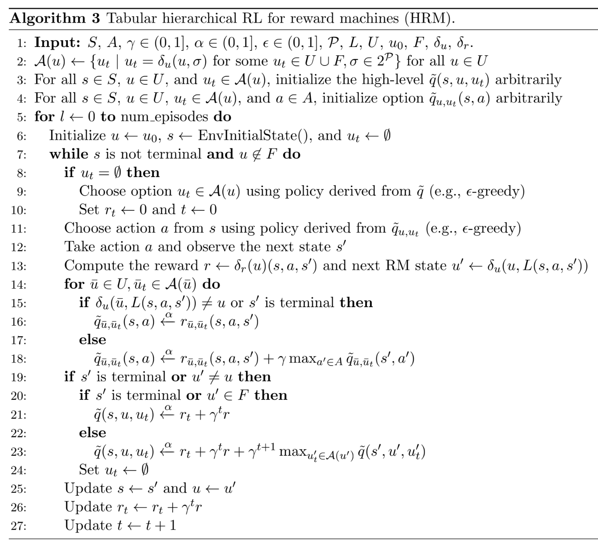

# Pseudo algorithm for the hierarchical Reinforcement Learning with Reward Machines Algorithm




```latex
\usepackage{algorithm}
\usepackage{algpseudocode}
\usepackage{amsmath}

\begin{algorithm}
\caption{Tabular hierarchical RL for reward machines (HRM).}
\begin{algorithmic}[1]
    \State \textbf{Input:} $S, A, \gamma \in (0, 1], \alpha \in (0, 1], \epsilon \in (0, 1], \mathcal{P}, L, U, u_0, F, \delta_u, \delta_r$.
    \State $\mathcal{A}(u) \leftarrow \{u_t \mid u_t = \delta_u(u, \sigma) \text{ for some } u_t \in U \cup F, \sigma \in 2^{\mathcal{P}}\}$ for all $u \in U$
    \State For all $s \in S$, $u \in U$, and $u_t \in \mathcal{A}(u)$, initialize the high-level $\tilde{q}(s, u, u_t)$ arbitrarily
    \State For all $s \in S$, $u \in U$, $u_t \in \mathcal{A}(u)$, and $a \in A$, initialize option $\tilde{q}_{u, u_t}(s, a)$ arbitrarily
    \For{$l \leftarrow 0$ \textbf{to} \text{num\_episodes}}
        \State Initialize $u \leftarrow u_0$, $s \leftarrow \text{EnvInitialState}()$, and $u_t \leftarrow \emptyset$
        \While{$s$ is not terminal \textbf{and} $u \notin F$}
            \If{$u_t = \emptyset$}
                \State Choose option $u_t \in \mathcal{A}(u)$ using policy derived from $\tilde{q}$ (e.g., $\epsilon$-greedy)
                \State Set $r_t \leftarrow 0$ and $t \leftarrow 0$
            \EndIf
            \State Choose action $a$ from $s$ using policy derived from $\tilde{q}_{u, u_t}$ (e.g., $\epsilon$-greedy)
            \State Take action $a$ and observe the next state $s'$
            \State Compute the reward $r \leftarrow \delta_r(u)(s, a, s')$ and next RM state $u' \leftarrow \delta_u(u, L(s, a, s'))$
            \For{$\bar{u} \in U, \bar{u}_t \in \mathcal{A}(\bar{u})$}
                \If{$\delta_u(\bar{u}, L(s, a, s')) \neq u$ \textbf{or} $s'$ is terminal}
                    \State $\tilde{q}_{\bar{u}, \bar{u}_t}(s, a) \xleftarrow{\alpha} r_{\bar{u}, \bar{u}_t}(s, a, s')$
                \Else
                    \State $\tilde{q}_{\bar{u}, \bar{u}_t}(s, a) \xleftarrow{\alpha} r_{\bar{u}, \bar{u}_t}(s, a, s') + \gamma \max_{a' \in A} \tilde{q}_{\bar{u}, \bar{u}_t}(s', a')$
                \EndIf
            \EndFor
            \If{$s'$ is terminal \textbf{or} $u' \neq u$}
                \If{$s'$ is terminal \textbf{or} $u' \in F$}
                    \State $\tilde{q}(s, u, u_t) \xleftarrow{\alpha} r_t + \gamma^t r$
                \Else
                    \State $\tilde{q}(s, u, u_t) \xleftarrow{\alpha} r_t + \gamma^t r + \gamma^{t+1} \max_{u'_t \in \mathcal{A}(u')} \tilde{q}(s', u', u'_t)$
                \EndIf
                \State Set $u_t \leftarrow \emptyset$
            \EndIf
            \State Update $s \leftarrow s'$ and $u \leftarrow u'$
            \State Update $r_t \leftarrow r_t + \gamma^t r$
            \State Update $t \leftarrow t + 1$
        \EndWhile
    \EndFor
\end{algorithmic}
\end{algorithm}
```