# Baseline graphs: "after" vs "only after" — three executions side by side

Left column: plain **after**. Right column: **only after**. Rows: three independent runs of the
ARM-FM baseline RM generator (same model, same environment file, nothing else generated).

Each cell is the same Reward Machine as in `AFTER-vs-ONLY-AFTER.md`, rendered to SVG by
`app/scripts/render_rm.py` using the app's node/edge classification and colour theme.
Click an image to open the full-size SVG.

---

## 1. MiniGrid DoorKey

Task: `Open the door [only] after acquiring the key.`

<table>
  <thead>
    <tr><th>Execution</th><th>After</th><th>Only after</th></tr>
  </thead>
  <tbody>
    <tr>
      <td>1</td>
      <td><a href="rm-graphs/AFTER-vs-ONLY-AFTER-01.svg">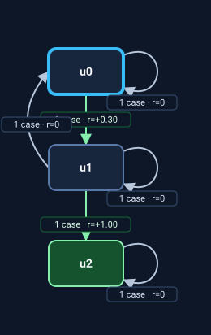</a></td>
      <td><a href="rm-graphs/AFTER-vs-ONLY-AFTER-02.svg">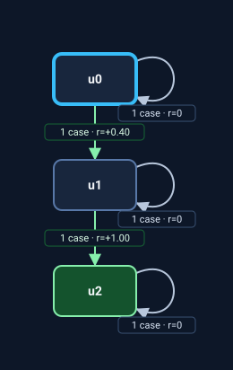</a></td>
    </tr>
    <tr>
      <td>2</td>
      <td></td>
      <td><a href="rm-graphs/AFTER-vs-ONLY-AFTER-04.svg">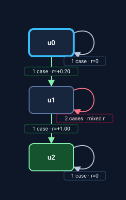</a></td>
    </tr>
    <tr>
      <td>3</td>
      <td><a href="rm-graphs/AFTER-vs-ONLY-AFTER-05.svg">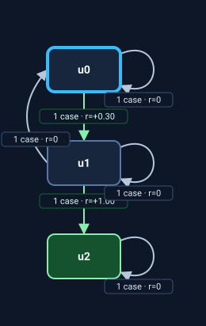</a></td>
      <td></td>
    </tr>
  </tbody>
</table>

Obs: the two wordings are near-identical in all three runs (3 states, same `has_key -> door_open` chain). The only recurring difference is that *only after* handles key loss as a self-loop penalty (`key_lost -> u1, -0.1`) in execs 2-3, while *after* regresses to `u0` for free. Nothing here encodes door-before-key — the mechanic already forbids it.

---

## 2. BabyAI UnlockToUnlock

Task: `Open the prerequisite door [only] after acquiring its key.`

<table>
  <thead>
    <tr><th>Execution</th><th>After</th><th>Only after</th></tr>
  </thead>
  <tbody>
    <tr>
      <td>1</td>
      <td><a href="rm-graphs/AFTER-vs-ONLY-AFTER-07.svg">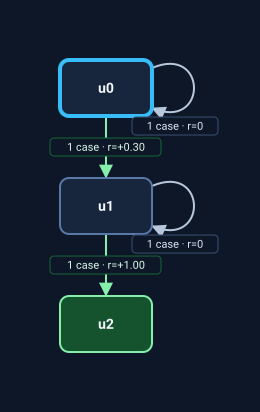</a></td>
      <td><a href="rm-graphs/AFTER-vs-ONLY-AFTER-08.svg">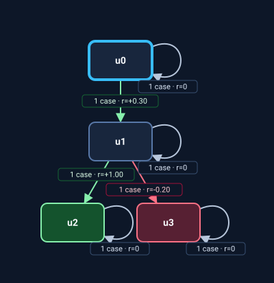</a></td>
    </tr>
    <tr>
      <td>2</td>
      <td></td>
      <td><a href="rm-graphs/AFTER-vs-ONLY-AFTER-10.svg">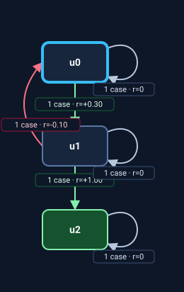</a></td>
    </tr>
    <tr>
      <td>3</td>
      <td></td>
      <td><a href="rm-graphs/AFTER-vs-ONLY-AFTER-12.svg">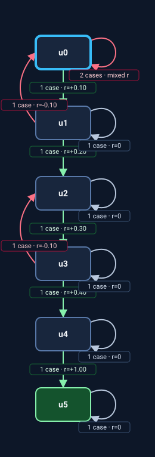</a></td>
    </tr>
  </tbody>
</table>

Obs: the widest spread in the grid. Exec 3 *only after* is the full 6-state paper-style chain (prerequisite key → prerequisite door → target key → target door → ball), while its *after* twin stops after the first door. Exec 1 *only after* adds a dead-end `u3`. So *only after* correlates with deeper decomposition and loss penalties — not with forbidding door-before-key.

---

## 3. Craftium Diamond

Task: `Acquire iron [only] after acquiring stone.`

<table>
  <thead>
    <tr><th>Execution</th><th>After</th><th>Only after</th></tr>
  </thead>
  <tbody>
    <tr>
      <td>1</td>
      <td></td>
      <td><a href="rm-graphs/AFTER-vs-ONLY-AFTER-14.svg">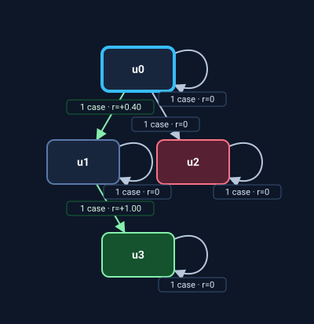</a></td>
    </tr>
    <tr>
      <td>2</td>
      <td></td>
      <td><a href="rm-graphs/AFTER-vs-ONLY-AFTER-16.svg">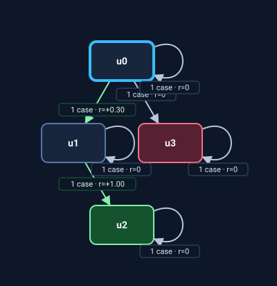</a></td>
    </tr>
    <tr>
      <td>3</td>
      <td><a href="rm-graphs/AFTER-vs-ONLY-AFTER-17.svg">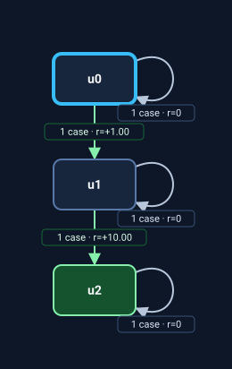</a></td>
      <td></td>
    </tr>
  </tbody>
</table>

Obs: the only place a true reverse-order branch ever appears. Execs 1-2 *only after* route `iron before stone` to a dead end. But exec 3 drops it entirely and is topologically identical to its *after* twin — so the single most promising signal is itself unstable. Exec 3 *after* also emits terminal `10` with `+1` for the intermediate. These propositions are independent one-time acquisitions, which is why the violation is even representable.

---

## 4. Meta-World Pick-Place

Task: `Place the puck at the goal [only] after moving it near the goal.`

<table>
  <thead>
    <tr><th>Execution</th><th>After</th><th>Only after</th></tr>
  </thead>
  <tbody>
    <tr>
      <td>1</td>
      <td><a href="rm-graphs/AFTER-vs-ONLY-AFTER-19.svg">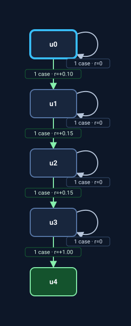</a></td>
      <td><a href="rm-graphs/AFTER-vs-ONLY-AFTER-20.svg">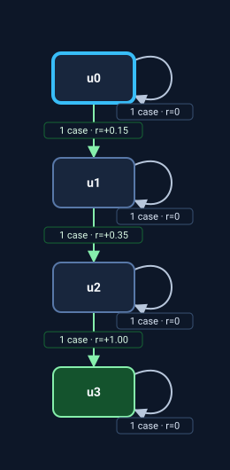</a></td>
    </tr>
    <tr>
      <td>2</td>
      <td></td>
      <td></td>
    </tr>
    <tr>
      <td>3</td>
      <td><a href="rm-graphs/AFTER-vs-ONLY-AFTER-23.svg">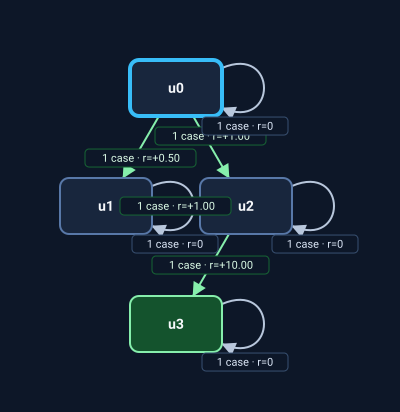</a></td>
      <td></td>
    </tr>
  </tbody>
</table>

Obs: *only after* is the stable column (4 states, same grasp → near goal → at goal chain all three runs). *after* is erratic: 5, then 3, then 4 states — and exec 3 pays `+1` for merely reaching near-goal with a terminal of `10`, a shaping shape you would have to reject. Again: decomposition and reward scale, not ordering.

---

## Quick tabulation

| Task | Exec | After: states | Only: states | After: reverse-guard | Only: reverse-guard | After: loss penalty | Only: loss penalty | Terminal = 1.0 |
|---|---|---|---|---|---|---|---|---|
| DoorKey | 1 | 3 | 3 | no | no | no | no | yes / yes |
| DoorKey | 2 | 3 | 3 | no | no | no | yes (-0.1) | **no (0.7)** / yes |
| DoorKey | 3 | 3 | 3 | no | no | no | yes (-0.1) | yes / yes |
| UnlockToUnlock | 1 | 3 | 4 | no | no | no | yes (-0.2) | yes / yes |
| UnlockToUnlock | 2 | 3 | 3 | no | no | no | yes (-0.1) | yes / yes |
| UnlockToUnlock | 3 | 3 | **6** | no | no | no | yes (3×-0.1) | yes / yes |
| Craftium | 1 | 3 | 4 | no | **yes** | no | no | yes / yes |
| Craftium | 2 | 3 | 4 | no | **yes** | no | no | yes / yes |
| Craftium | 3 | 3 | 3 | no | no | no | no | **no (10)** / yes |
| Pick-Place | 1 | 5 | 4 | no | no | no | no | yes / yes |
| Pick-Place | 2 | 3 | 4 | no | no | no | no | yes / yes |
| Pick-Place | 3 | 4 | 4 | no | no | no | no | **no (10)** / yes |

## Signal frequency (12 machines per column)

| Signal | After | Only after |
|---|---|---|
| Terminal reward = 1.0 | 9/12 | **12/12** |
| Negative penalty transition | 0/12 | **5/12** |
| Explicit reverse-order branch | 0/12 | 2/12 |
| ≥ 4 states | 2/12 | 7/12 |
| Intermediate reward = 1.0 (shaping hazard) | 2/12 | 0/12 |

## So is "only" consistent?

**As reward shaping — mostly yes.**

- Terminal reward is `1.0` in **every** `only after` machine (12/12) against 9/12 for `after`, which twice emits `10`.
- Negative penalties appear **only** under `only after` (5/12 vs 0/12), always on losing the precondition (`key_lost`, `required_key_lost`).
- `after` twice pays `+1` for an intermediate step and then `10` at the end (Craftium 3, Pick-Place 3). `only after` never does. If anything here is reliable, it is that `only` nudges toward a normalised, less hackable reward ladder.

**As a temporal operator — no.**

- An explicit reverse-order branch (`B` while `A` false) appears in only **2 of 12** `only after` machines — both Craftium, and the third Craftium run dropped it. `after` never produces one.
- Topology is unstable: the same wording spans **3 to 6 states**. `only after` tends to decompose further (7/12 have ≥ 4 states vs 2/12), but not systematically.
- The two wordings are topologically **identical** in one pair (Craftium 3), and the direction **flips** in another (UnlockToUnlock 1, where the precondition guard lands in the *after* cell).
- **0 of 24** machines use an absorbing rejecting sink. Out-of-order execution is never fatal — at worst unrewarded or penalised. `only` is not the compiler's hard precedence.

**Why it looks this way.** "Only after" is only encodable as a distinct constraint when the environment exposes the violation as an observable event. Craftium is the only task whose propositions are independent one-time acquisitions (`iron_acquired` without `stone_acquired` is a real state), and it is the only place a reverse guard ever appears. Where the precondition is tied to the mechanic — you must carry the key to open its door, and `at_goal` already implies being near the goal — there is no separate "B without A" fact to branch on, so the model reads `only` as *keep the precondition* and expresses it as a `key_lost` penalty instead of an ordering constraint.

**Bottom line.** `only` is a weak, non-deterministic nudge whose reliable effect is on **reward shape** (normalised terminal, penalty for losing the precondition), not on **ordering**. It is not a hard precedence operator, and the run-to-run variance of the *same* sentence is as large as the gap between the two wordings. For this generator, `after` and `only after` are effectively interchangeable prompts; if you need hard precedence, compile it.
