# ARM-FM baseline vs the compiler on MiniGrid DoorKey — graphs

Left column: the ARM-FM baseline. Right column: this project's compiler. Rows: three independent
runs of the same four tasks. Each cell is the Reward Machine written by that run, rendered to SVG
by `app/scripts/render_rm.py`; click an image to open the full-size SVG.

The Reward Machine text, per-task analysis, tabulations, critic findings, and timing are in
`ARM-FM-vs-COMPILER.md`. Raw artifacts live under `arm-fm-vs-compiler/`, and every
run records its own `run-log.json`.

---

## 1. `Use the key to open the door, then reach the goal.`

<table>
  <thead>
    <tr><th>Run</th><th>ARM-FM baseline</th><th>Compiler</th></tr>
  </thead>
  <tbody>
    <tr>
      <td>1</td>
      <td><a href="arm-fm-vs-compiler/run-1/arm-fm/task-1.svg">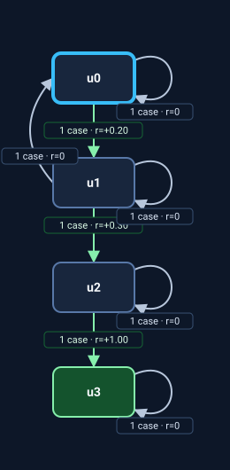</a></td>
      <td></td>
    </tr>
    <tr>
      <td>2</td>
      <td><a href="arm-fm-vs-compiler/run-2/arm-fm/task-1.svg">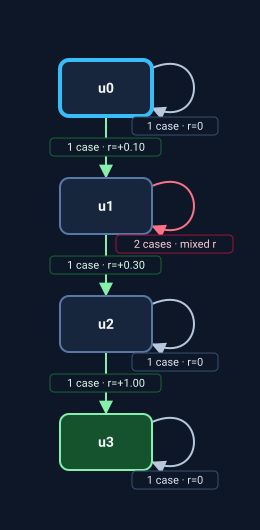</a></td>
      <td></td>
    </tr>
    <tr>
      <td>3</td>
      <td><a href="arm-fm-vs-compiler/run-3/arm-fm/task-1.svg">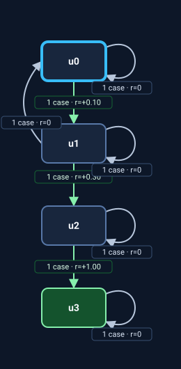</a></td>
      <td><a href="arm-fm-vs-compiler/run-3/compiler/task-1.svg">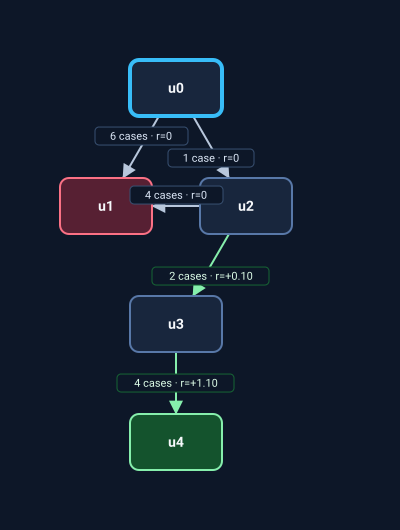</a></td>
    </tr>
  </tbody>
</table>

---

## 2. `Eventually acquire the key.`

<table>
  <thead>
    <tr><th>Run</th><th>ARM-FM baseline</th><th>Compiler</th></tr>
  </thead>
  <tbody>
    <tr>
      <td>1</td>
      <td></td>
      <td></td>
    </tr>
    <tr>
      <td>2</td>
      <td></td>
      <td></td>
    </tr>
    <tr>
      <td>3</td>
      <td><a href="arm-fm-vs-compiler/run-3/arm-fm/task-2.svg">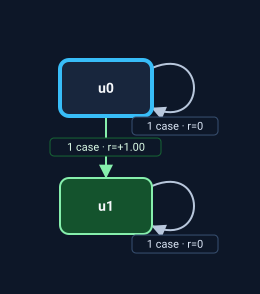</a></td>
      <td><a href="arm-fm-vs-compiler/run-3/compiler/task-2.svg">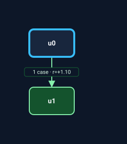</a></td>
    </tr>
  </tbody>
</table>

---

## 3. `Open the door only after acquiring the key.`

<table>
  <thead>
    <tr><th>Run</th><th>ARM-FM baseline</th><th>Compiler</th></tr>
  </thead>
  <tbody>
    <tr>
      <td>1</td>
      <td><a href="arm-fm-vs-compiler/run-1/arm-fm/task-3.svg">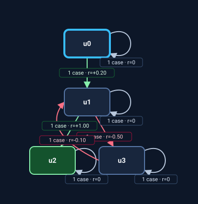</a></td>
      <td><a href="arm-fm-vs-compiler/run-1/compiler/task-3.svg">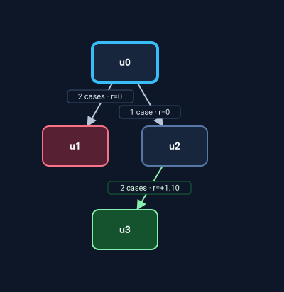</a></td>
    </tr>
    <tr>
      <td>2</td>
      <td><a href="arm-fm-vs-compiler/run-2/arm-fm/task-3.svg">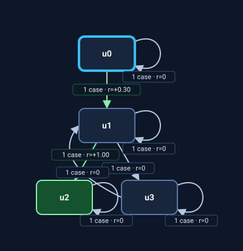</a></td>
      <td></td>
    </tr>
    <tr>
      <td>3</td>
      <td><a href="arm-fm-vs-compiler/run-3/arm-fm/task-3.svg">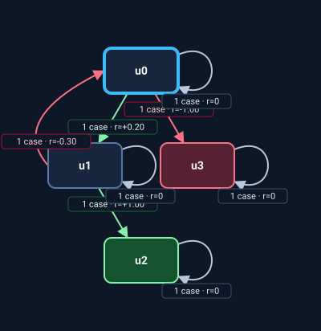</a></td>
      <td></td>
    </tr>
  </tbody>
</table>

---

## 4. `Reach the goal only after opening the door.`

<table>
  <thead>
    <tr><th>Run</th><th>ARM-FM baseline</th><th>Compiler</th></tr>
  </thead>
  <tbody>
    <tr>
      <td>1</td>
      <td><a href="arm-fm-vs-compiler/run-1/arm-fm/task-4.svg">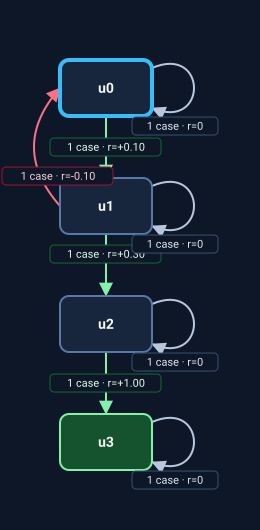</a></td>
      <td></td>
    </tr>
    <tr>
      <td>2</td>
      <td><a href="arm-fm-vs-compiler/run-2/arm-fm/task-4.svg">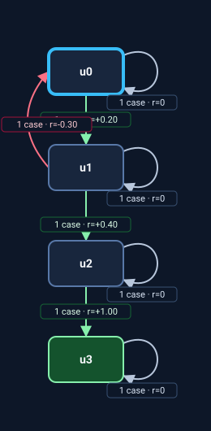</a></td>
      <td></td>
    </tr>
    <tr>
      <td>3</td>
      <td><a href="arm-fm-vs-compiler/run-3/arm-fm/task-4.svg">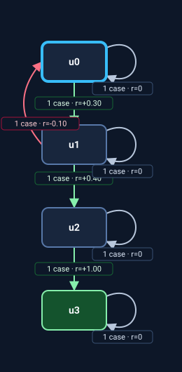</a></td>
      <td></td>
    </tr>
  </tbody>
</table>
